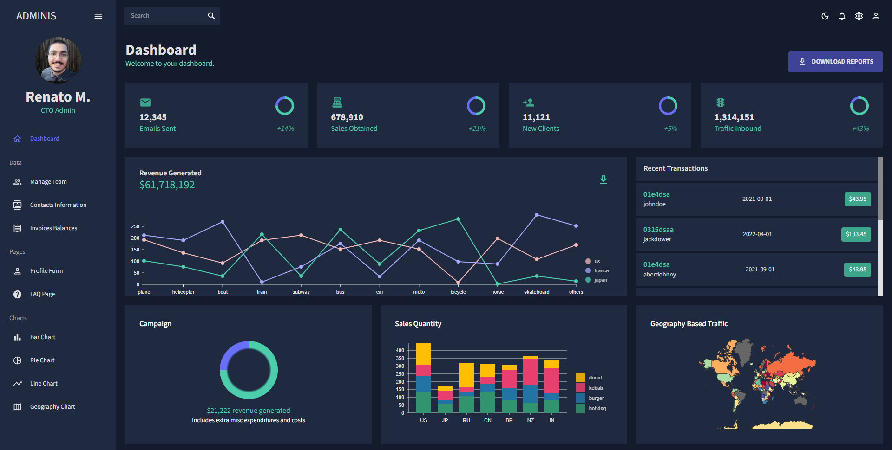
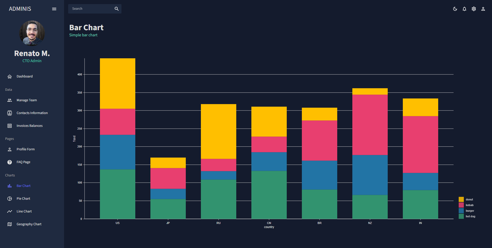
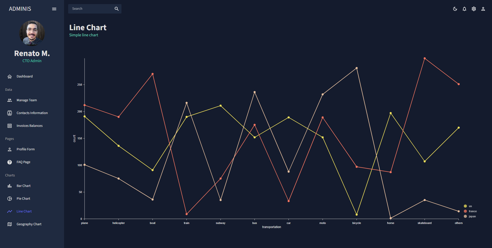
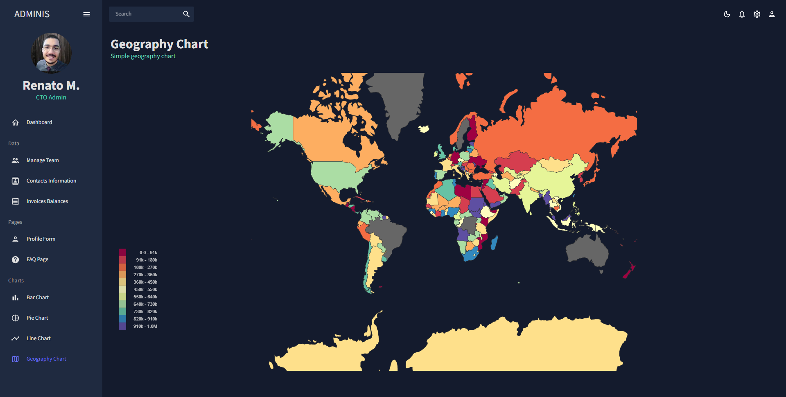
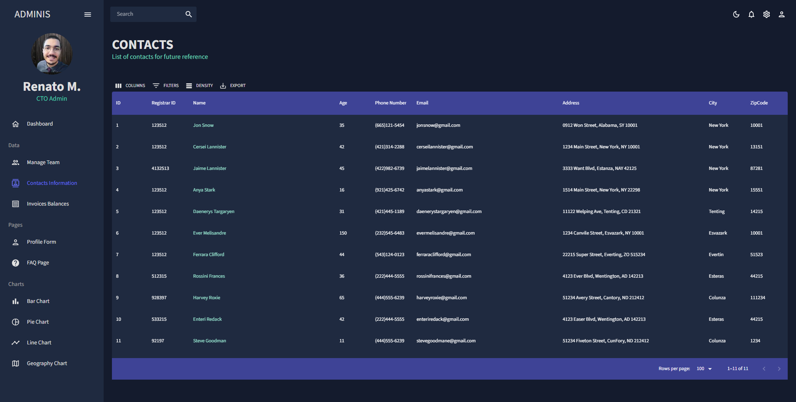

<h1 align="center">
  
📊 Admin Dashboard

  

    
    
    
    
    
  

</h1>

## ✨ Description

This app was developed to simulate an administrative dashboard with tables, forms, and charts.
It uses fake data to display fictitious values.

## 🚀 Technologies
-  React
    -  States, hooks, props
-  Next.js 13
    -  SSR, SSG, App router
-  TypeScript
-  Nivo charts
-  Material UI
-  Formik + Yup
-  React Pro Sidebar

## 💻 Installation

After cloning/downloading this repository, open your terminal, navigate to the project's directory then run:

-  `npm install` - To install packages dependencies
-  `npm run dev` - To run the application on your localhost

## 🌟 Preview

